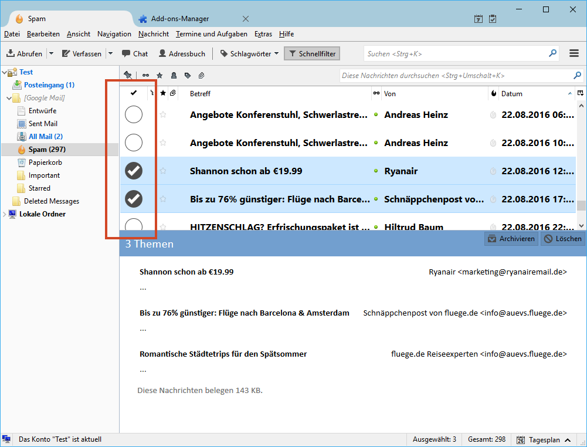
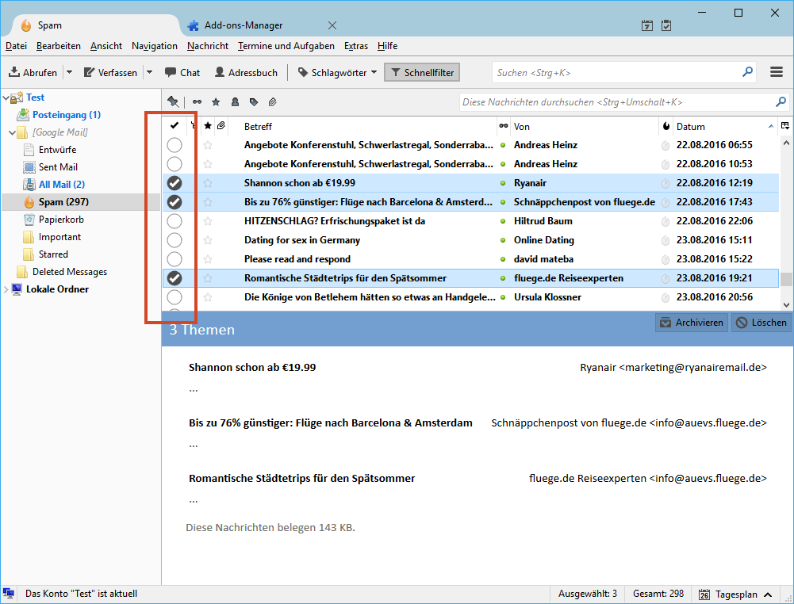

# A checkbox column for Thunderbird

Adds a custom column to the Thunderbird's messages list (thread tree), making it easier to select multiple messages on devices with a touchscreen display. 
You can toggle the selection status of a row by clicking/tapping the :white_circle:. By default, the row height is increased to reduce potential tapping errors.
This can be turned off in the extension's settings.

## Installation

## Screenshots

